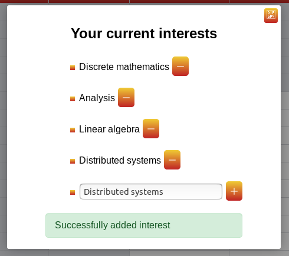
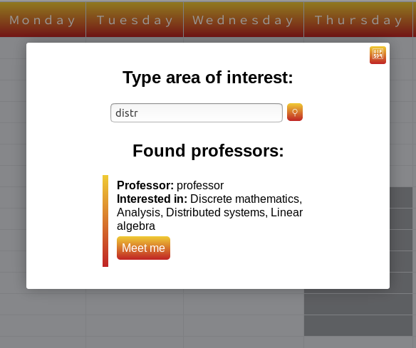
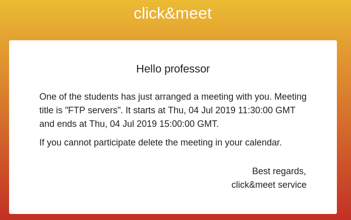

# click-meet
## Overview
ClickMeet is an application designed to help arrange meetings between students and professors.
Professors can specify their fields of interests and weekly availability.
Students can search for professors available at a given time slot, that are interested in a given topic.
When student reserves meeting with a professor, professor gets email notification.
When professor cancels meeting with a student, student receives email notification.
## How to run
All you have to do is go to main folder and write
```bash
docker-compose up --build
```
When all containers are ready, go to localhost:8090.
## Examples
|  |
| :--: |
| *Specifying intersts* |
|  |
| :--: |
| *Looking for available professors* |
|  |
| :--: |
| *Reservation notification* |